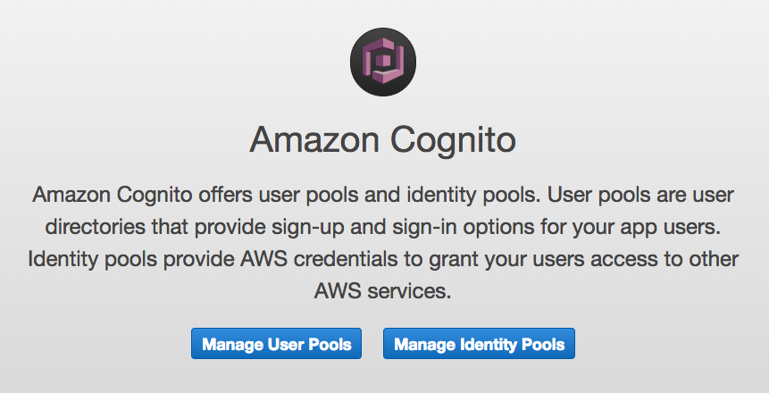
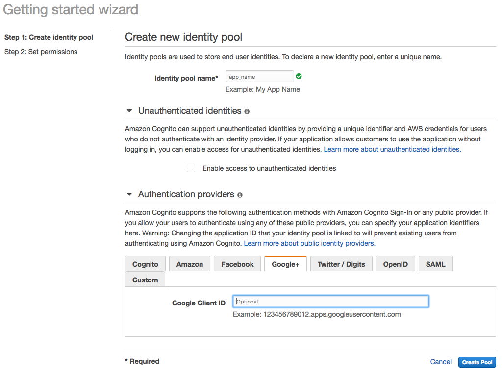
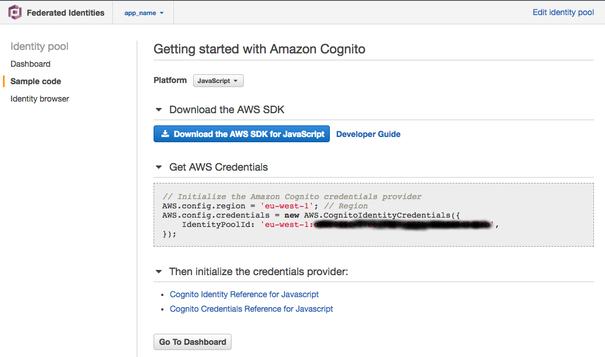

# aws-cognito-express-example
Example Express Node application using AWS Cognito with Google OAuth2.


## Tutorial

During the tutorial you will need to store credentials:

1. GOOGLE_CLIENT_ID=
1. GOOGLE_CLIENT_SECRET=
1. GOOGLE_CALLBACK=http://127.0.0.1:3000/auth/google/callback
1. DOMAIN_EMAILS=your-company-domain.com or blank for no restriction

1. AWS_ACCOUNT_ID=
1. COGNITO_AWS_REGION=
1. COGNITO_IDENTITY_POOL_ID=

1. COGNITO_IDENTITY_POOL_ARN=
1. COGNITO_DATASET_NAME=my_pool

### Register OAuth 2.0 client ID
see https://github.com/tsamaya/passport-example-with-google-oauth2

### Create AWS account

With this tutorial, you need an AWS account. You can find more details on how to create an AWS account in the [AWS documentation]().

### Creating an AWS User
In the AWS console, open the IAM service, navigate to “Users” and select “Add user” to create a new user: `simple-webservice-user`.

### Create a Cognito Pool



click `Manage Identity Pools`

fill the `Identity pool name`, leave the defaul `Enable access to unauthenticated identities`



add the Google Client ID

create the identity pool. An IAM role is about to be create. Click Allow. The getting started with Amazon Cognito provides the `Identity Pool ID`, mark the value for `COGNITO_IDENTITY_POOL_ID`



A Cognito pool is created and we can viewing its dashboard.


### let's code now

```shell
    # init package json file
    $ npm init -y
    # install dependencies
    #   - read .env file
    $ npm i -S dotenv
    #   - handy date format
    $ npm i -S moment
    #   - passport for google-oauth2
    $ npm i -S passport passport-google-oauth20
    #   - AWS javascript SDK
    $ npm i -S aws-sdk
    #   - express framework
    $ npm i -S express body-parser cookie-parser morgan hbs
    # let's create the server file
    $ touch server.js
```

_TBC_


```shell
    # init package json file
    $ npm i -D husky lint-staged
    $ npm i -D eslint eslint-config-airbnb-base eslint-plugin-import
    $ npm i -D prettier eslint-config-prettier eslint-plugin-prettier
    $ touch .eslintignore .eslintrc.js .prettierignore .prettierrc.js
```

## Resources

- [Amazon Cognito in your Node.js web app](https://aws.amazon.com/blogs/mobile/amazon-cognito-in-your-node-js-web-app/)
